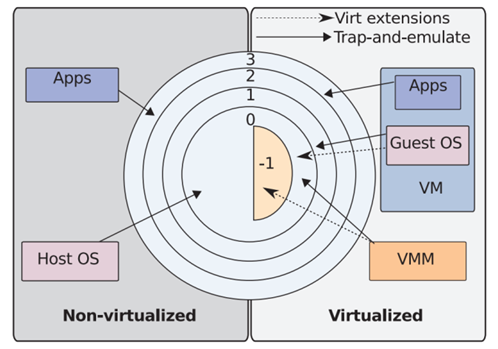

<!-- _class: title -->
# Virtual machines through the OS lens
Andrei Litvinenco
University of Bucharest
3.08.2026

  
  
github.com/andreialitvinenco/osds-final-paper

---
# Table of content
- A brief history of virtualisation
- Popek Goldberg theorem
- The privilege problem and virtualisation strategies
- Virtual machines taxonomy and clasification
- CPU privileges management
- Memory virtualisation
- I/O virtualisation
- Security advantages and attack vectors
- Conclusions

---
# A Brief history of virtualization

<!-- Virtualization is not a new concept. It originated in the 1980s in IBM laboratories as a practical solution to partition highly expensive mainframe systems. The goal was to maximize hardware utilization by allowing multiple, independent operating systems to execute simultaneously. This is achieved via a virtual machine monitor, or hypervisor, which sits between the physical hardware and the guest OS, creating an isolated illusion of a fully dedicated physical machine for every guest instance. -->

From Mainframes to Modern Desktops

- The Origins (1960s): Virtualization is not a new concept; it began with IBM's project in 1964 to share the capabilities of physical computers. The "CP/CMS" system defined the term "Virtual Machine," allowing one computer to function as several copies of itself.

- Defining Principles (1974): Researchers Popek and Goldberg established the formal principles of virtualization: Faithfulness, Performance, and Security. They defined a Virtual Machine Monitor (VMM) as a software layer that virtualizes physical machine resources.

---
# A Brief history of virtualization
- The x86 Revival (1999): Interest waned until VMware Inc. introduced the "VMware Virtual Platform" in 1999, bringing virtualization to the standard x86-32 architecture.
<!-- (Optional) Inainte de VMware virtualizarea se facea doar la nivel de mainframe si nu era fezabil. Odata cu VMware virtual platofrm (workstation 1.0) virtualizarea a devenit mai accesibila prin portarea la ahitecturile x86-->

- Open Source Innovation (2003): The Xen project, originating from the University of Cambridge, introduced paravirtualization, enabling physical computers to boot multiple operating systems efficiently.

- Hardware Support (2005-2006): Chip manufacturers finally embedded virtualization support directly into processors with Intel VT-x and AMD "Pacifica" extensions, solving many early architectural challenges.

---

<!-- Understanding modern virtualization requires looking at the foundation established in 1974 by Gerald Popek and Robert Goldberg. They defined the strict criteria a processor architecture must meet to be natively virtualizable. They categorized processor instructions into three types: privileged instructions that trap into the OS kernel if executed in user mode, control-sensitive instructions that modify system state, and behavior-sensitive instructions that reveal the current privilege level. The theorem states that native virtualization is only possible if all sensitive instructions are a strict subset of privileged instructions. The original x86 architecture famously failed this test—having 17 unprivileged but sensitive instructions like POPF and SGDT—which required complex software emulation until hardware extensions were introduced in 2005.  -->
# Popek Goldberg theorem regarding with virtualizable CPUs
In 1974 Gerald J. Popek and Robert P. Goldberg published the paper "Formal Requirements  or Virtualizable Third Generation Architectures" in which they dened the strict criterias that a processor architecture must meet to be considered natively virtualizable without modifying the guest system operating system.
1. **Privileged instructions**: These are the instructions that generate a hardware trap if executed in user mod also known as unprivileged, transferring control to the operating system kernel.
2. **Control sensitive instructions**: These are the instructions that attempt to modify of the physical resources or the system state.
3. **Behaviour sensitive instructions**: These are the instructions whose execution depends on the current state of the hardware or that reveal the privilege level at which code is running.
---
# Popek Goldberg theorem in regards with hypervisors
1. Faithfulness. Except for timing effects, software on the VMM runs just like it does on hardware.
2. Performance. Without the VMM's assistance, the hardware carries out the vast majority of guest commands.
3. Security. All hardware resources are managed by the VMM. Trap-and-emulate, a specific VMM implementation approach, was so common in 1974 that it was thought to be the only workable virtualisation technique. 

---
# The privilege problem (x86 Rings)

<!-- De ce virtualizarea este dificila pe hardware standard? -->

- **Standard Execution Levels**: In a physical computer, the Operating System (OS) operates in Kernel Mode (Ring 0), giving it access to all privileged instructions. User applications run in User Mode (Ring 3) and cannot access privileged instructions directly.

- **The Conflict**: To virtualize a system, the Guest OS expects to run in Ring 0 to control the hardware. However, the Host VMM (Hypervisor) is already occupying Ring 0.

- **The Challenge**: If a Guest OS runs in a less privileged ring (like Ring 1 or 3), it cannot execute necessary privileged instructions. Traditional x86 architecture was not built to facilitate full virtualization because it did not naturally trap these privileged instructions effectively.
---
# Strategy 1 - OS level virtualization

This method virtualizes at the operating system level rather than the hardware level. The host OS kernel is modified to support multiple isolated "containers" (also known as Virtual Private Servers or Jails).
- **Mechanism**: Every container shares the same host operating system kernel. This is different from running a full virtual machine with its own distinct kernel.
- **Pros & cons**:
    - **Advantage**: Implementations like OpenVZ, LXC (Linux Containers), and Docker exhibit very low overhead.
    - **Disadvantage**: You cannot run different kernels (e.g., you cannot run Windows on a Linux host using this method).

---
# Strategy 2 - Para-virtualization 

Para-virtualization replaces the standard instruction set architecture with a unique set of software instructions known as Hypercalls.
- **Execution**: The VMM (Hypervisor) operates directly on the hardware (Ring 0). The Guest OS is modified to recognize it is virtualized and communicates with the VMM via these Hypercalls instead of trying to execute privileged instructions directly.

- **Pros & cons:**
    - **Advantage**: It offers low virtualization overhead because it avoids complex "trap-and-emulate" operations.
    - **Disadvantage**: The Guest OS kernel must be explicitly modified to use Hypercalls, meaning you cannot run unmodified, off-the-shelf operating systems easily.

---
# Strategy 3 - Binary translation for unmodified guest OS

This strategy allows the execution of unmodified guest operating systems through Binary Translation or full emulation. Essentially running legacy systems via software translation.
- **Full Emulation**: Software like QEMU simulates the entire instruction set of a CPU (e.g., running PowerPC code on an x86 processor). This is flexible but has high overhead.
- **Binary Translation**: Solutions like VMware use a hybrid approach. They allow most user-code to run directly on the CPU for speed. However, privileged code (Ring 0 instructions) is trapped and translated by the VMM into safe code sequences.
- **Performance**: This performs better than full emulation but still incurs overhead compared to running natively. It is strictly limited to guests that match the host architecture (e.g., x86 Guest on x86 Host).

---
# Strategy 4 - Hardware assisted virtualization

Modern processors (Intel VT-x, AMD-V) include hardware extensions specifically for virtualization, eliminating the need for binary translation or paravirtualization.
- **Root** vs. **Non-Root**: These extensions create new operating modes to handle privileges natively in hardware.
    - **Guest OS**: Runs in Ring 0 Non-Root mode without modification, believing it has full control.
    - **VMM/Hypervisor**: Runs in VMX Root mode (Ring 0 Root), intercepting privileged events automatically.

- **Benefits**: This method removes the software overhead of the "trap and emulate" model by handling privileges in hardware. Examples include KVM, VirtualBox, and modern VMware products.

---
<!-- Depending on the abstraction level, virtual machines generally fall into two categories. Process Virtual Machines provide an Application Binary Interface layer to run a single user program isolated from the host, like the JVM or Docker containers. System Virtual Machines emulate an entire hardware platform to run a fully independent OS. These are further split into Type I bare-metal hypervisors, like VMware ESXi or Xen, running directly on hardware, and Type II hosted hypervisors, like VirtualBox, running on top of a standard host OS.  -->
# Classification of hypervisors
- **Type I (Native/Bare-Metal)**:
    - **Architecture**: Runs directly above the hardware in the Ring of Highest Privilege.
    - **Function**: It manages memory, CPU scheduling, and I/O directly, without an underlying operating system.
    - **Examples**: VMware ESX, Hyper-V, Xen.

- **Type II (Hosted)**:
    - **Architecture**: Runs inside a standard Host Operating System (like Windows or Linux) alongside other applications.
    - **Function**: It relies on the Host OS process scheduler; every Virtual Machine is just another process to the host.
    - **Examples**: VMware Server, VirtualBox.

---
# Classification of hypervisors

---
<!-- Processors in the x86 family use four protection rings, with Ring 0 carrying maximum privileges for the OS kernel, and Ring 3 holding the least for user applications. To maintain total control, the hypervisor must be the sole entity running in Ring 0. This forces the guest OS into a technique called "Ring Deprivileging," where it operates in Ring 1 or 3. When the guest attempts to execute a privileged instruction, it lacks the physical permissions, triggering a General Protection Fault. The hypervisor catches this hardware trap, safely simulates the instruction's effect for that specific VM, and returns control to the guest.  

Software-based ring deprivileging is complex and slow, leading Intel and AMD to introduce native hardware support. Taking Intel VT-x as an example, the CPU operates in two parallel modes. "VMX Root Operation" is the fully privileged mode where the hypervisor runs. "VMX Non-Root Operation" is dedicated to the virtual machines, allowing the guest OS to run in its own Ring 0, providing the illusion of full control. Transitions are handled by a hardware structure called the VMCS. The hypervisor triggers a "VM Entry" to load the guest state, and any sensitive guest operation triggers an automatic "VM Exit," safely suspending the VM and returning control to the hypervisor in Root mode. -->

# CPU privilage management
## Protection rings and privileges
- x86 architecture uses protection rings, prioritizing Ring 0 for OS kernel and Ring 3 for users.
- Ring deprivileging forces the guest OS into a lower ring allowing the hypervisor to safely intercept hardware traps.
- Intel VT-x hardware assist introduces VMX Root and HMX Non-Root operating modes.
- The virtual machine control structure rapidly handles state transitions via VMentry and  VMexit calls

---
# CPU privilege management

<!-- In centrul diagramei avem multiple cercuri concentrice numeroatate de la 0 la 3 care reprezinta cate un protection domain al procesorului.

Ring 0 (Most Privileged): Aici putem gasi kernel-ul, el are acces direct la resursele hardware (CPU, Memory, I/O).

Rings 1 & 2: Au fost folosite in trecut pentru drivere de I/O dar nu mai sunt folosite pe sistemul de operare moderne.

Ring 3 (Least Privileged): Userspace unde se afla aplicatii precum Chrome, Word, etc. Tot ce se gaseste in userspace nu are acces direct la hardware pentru a preveni crash-urile.-->
---
# The memory challanges with address translation
- Software uses "Virtual Addresses" which the hardware (MMU) translates into "Physical Addresses" using Page Tables.

- The Hypervisor must enforce an additional level of translation to isolate guests from each other. The Guest's "Physical Memory" is actually just virtual memory to the Host system.

---
<!-- Memory virtualization is a primary performance bottleneck because it requires a two-step translation: translating the Guest Virtual Address to a Guest Physical Address, and then translating that Guest Physical Address to the actual Host Physical Address. Hypervisors handle this using two main architectures. Shadow Paging uses software to map guest virtual addresses directly to host physical addresses. It is fast for lookups, requiring only 4 memory references, but guest page table updates trigger costly software traps. -->
# Memory virtualisation
## Shadow paging
- For unmodified guests, the VMM must fully virtualize x86 paging.
- Maps $gVA \rightarrow hPA$ via shadow pages.
- The VMM must "trace" or trap every time the Guest OS tries to update its page tables to keep the shadow tables in sync.
- Extremly fast for TLB misses, requiring simple 1D page walks composed of only 4 memory references.
- However it requires write-protecting guest page tables. Any guest update generates a costly software trap (VMexit).

---
<!-- Nested Paging relies on hardware to maintain two parallel page tables. Guests can update their tables freely, but a single Translation Lookaside Buffer miss forces the hardware into a massive 24-reference, two-dimensional page walk. -->
# Memory virtualisation
## Nested paging
- Uses hardware asissted parallel page tables, such as Intel EPT, allowing the guest OS to modify memory freely.
- Eliminates VMExit traps during memory updates but introduces a severe performance penalty for TLB misses.
- A single 2D page walk requires 24 references which degrades speed for highly dynamic datasets.
$$
        \begin{equation} \label{eq:2dwalk}
        \begin{split}
        &\\ \text{2D Walk Memory References} 
        &\quad = N_{\text{guest}} \times N_{\text{host}} + N_{\text{guest}} + N_{\text{host}} \\
        &\quad = 4 \times 4 + 4 + 4 = 24
        \end{split}
        \end{equation}
$$

---
<!-- To balance these tradeoffs, researchers developed Agile Paging. It uses a hybrid approach: upper-level page tables, which rarely change, are handled in fast Shadow Paging mode, while highly active lower-level leaves dynamically switch to hardware Nested Paging. This drops the memory accesses per TLB miss to an optimized 4.8. Another breakthrough is Remote Paging for datacenters. Instead of writing memory to a slow local disk swap, the hypervisor uses high-speed networks to page out to the idle RAM of other servers. By utilizing page deduplication and hashing, it acts as a transparent, high-performance caching layer without disrupting the guest OS. -->
# Advanced paging techniques
## Agile paging
Uses spatio-temporal hybrid approach. Retains fast shadow paging for static upper memory levels while dynamically switching to nested paging for frequently modified page leaves.

## Remote Paging
Prevents physical memory exhaustion by utilizing the idle RAM of other DC servers as a transparent, ultra fast swap extension over Gibabit Ethernet.

* **Hash comparing** deduplicates memory pages over the network during remote paging. Generating unique hashes it veifies identical pages, saving both bandwidth and storage.

---
<!-- Input/Output virtualization is complex because Direct Memory Access controllers require absolute physical addresses and operate independently of the CPU's memory management unit. Network cards or storage controllers cannot traverse guest page tables, meaning the hypervisor must intercept and translate every virtual buffer address into a real host address before executing the transfer. Interceptions can happen at the raw instruction level, the device driver level, or the system call boundary. Type II hypervisors handle this via a hybrid stack—a kernel monitor for privileged instructions, a user-space app for complex tasks, and a fast communication driver.  

Because software-emulated I/O causes high overhead from buffer copying and constant VM Exits, systems use I/O Passthrough. This maps a physical device, like a 10G network card, directly into the guest VM's address space, completely bypassing the hypervisor for native speeds. However, this creates a critical security risk: a compromised guest could use DMA to overwrite the host's physical RAM. The solution is the IOMMU, or Input-Output Memory Management Unit. It acts as a dedicated MMU for peripherals, translating PCIe bus requests in real-time and instantly blocking any unauthorized DMA access, preventing hardware-based VM escape attacks.  -->
# I/O virtualisation
## Overcoming DMA bottlenecks
- Software emulated I/O suffers from high overhead due to continuous VMExits and complex buffer copying processes.
- I/O Passthrough maps physical devices directly to guest memory thus operating at hardware native speeds.
- IOMMU through Intel VT-d or AMD-Vi acts as a dedicated MMU for pheripherals, translating direct memory accesses instantly. It also actively block unauthorized DMA attempts protecting, in this way, the host memory from compromised guests.

---
<!-- Virtualization completely redefines our attack surface. On the defensive side, it offers strong isolation, rapid snapshot restoration to recover from ransomware, and safe sandboxing for out-of-band monitoring. However, it introduces severe attack vectors. A VM Escape allows an attacker to exploit hypervisor emulation bugs to achieve root access on the host, compromising the entire infrastructure. Other threats include host-guest shared folder leaks, resource starvation causing Denial of Service, and virtual switch ARP poisoning. To mitigate these, modern enterprise architectures utilize micro-hypervisors to strip away vulnerable emulation code, alongside hardware-assisted encryption like AMD SEV and Intel SGX to encrypt VM RAM at the physical chip level.   -->
# Security advantages
- **Strong Isolation**: Virtual machines run in completly segmented spaces preventing attackers from accesing adjacent memory.
- **Rapid Restoration**: Snapshot capabilities allow administrators to revert systems to a clean state in seconds after ransomware attacks or systme failures.
- **Safe Sandboxing**: Provides completly isolated lab enviroments ideal for detonating malware with out-of-band monitoring and behavior analysis.

---
# VM attack vectors

- **VM Escape**: The most severe threat, where attackers exploit hypervisor emulation to gain full Ring 0 access on the host OS.
- **Host-Guest Channels**: Shared clipboards and folders meant for convenience can be weaponized by malware to leak sensitive data outside the perimeter.
- **Resource Starvation**: "Noisy neighbor" attacks execute infinite loops or massive I/O transactions to starve legimite VMs of physical resources.
- **Packet sniffing**: Compromised virtual machines can execute ARP poisoning or MAC Flooding attacks to intercept traffic across shared internal virtual switches.
---

# Conclusions
Over the years virtualiation has evolved a lot from IBM’s early theoretical projects and specific mainframe applications into the backbone of the modern cloud.
Early techniques like trap and emulate had been replaced by hardware assisted CPU extensions and multiple Type I and Type II hypervisor architectures which manages hardware abstractization in a completly different way. Advances such as the agile paging and hardware I/O virtualisation methods like IOMMU and I/O Passthrough proves that the boundary between hardware and software is slowly fading and thus virtualisation becomes more fluid in modern systems. 

---

# Conclusion

<h2>Future of virtualisation​</h2>

As the boundary between hardware and software fades, virtualisation continues to evolve rapidly. The integration of physical, chip controlled security such as AMD SEV and Intel SGX, ensures fully encrypted RAM and impenetrable isolation, cementing virtual machines as the secure backbone of modern cloud infrastrucutres.

---

# Conclusions

<h2>Thank you for your time! 👋​</h2>

---
# References

<!-- _class: tinytext -->
[1] Cloud Security Alliance. A survey of hypervisorlevel security vulnerabilities and virtualization risks. Journal of Cloud Security and Virtualization, 11(3):78–92, 2018.
[2] Jayneel Gandhi, Arkaprava Basu, Mark D. Hill, and Michael M. Swift. Agile paging: Balancing the trade-offs of translation architectures. In Proceedings of the International Conference on Architectural Support for Programming Languages and Operating Systems (ASPLOS), pages 121–134, 2016.
[3] Robert P. Goldberg. Architectural Principles for Virtual Computer Systems. PhD thesis, Harvard University, Cambridge, MA, 1973.
[4] Rony Karamagi and Mussa Ally. Implementation of internetworking with host internet in oracle virtualbox guest virtual machines. International Journal of Computer Applications, 176(12):34–45, 2020.
[5] Samuel T. King, George W. Dunlap, and Peter M. Chen. Operating system support for virtual machines. In Proceedings of the USENIX Annual Technical Conference, pages 71–84, 2003.
[6] Remote Paging Paper. Hypervisor-based remote paging model for virtual machines. In Proceedings of the International Workshop on Virtualization Technologies, pages 45–56, 2008.
[7] Gerald J. Popek and Robert P. Goldberg. Formal requirements for virtualizable third generation architectures. Communications of the ACM, 17(7):412–421, 1974.
[8] Janmejaya S. Reuben. A survey on virtual machine security. Technical report, Helsinki University of Technology, 2007.
[9] Joshua Reuben. Virtual machine security: A survey of technologies, threats, and benefits. SANS Institute InfoSec Reading Room, pages 1–24, 2007.
[10] James E. Smith and Ravi Nair. Virtual Machines: Versatile Platforms for Systems and Processes. Morgan Kaufmann Publishers, 2005.
